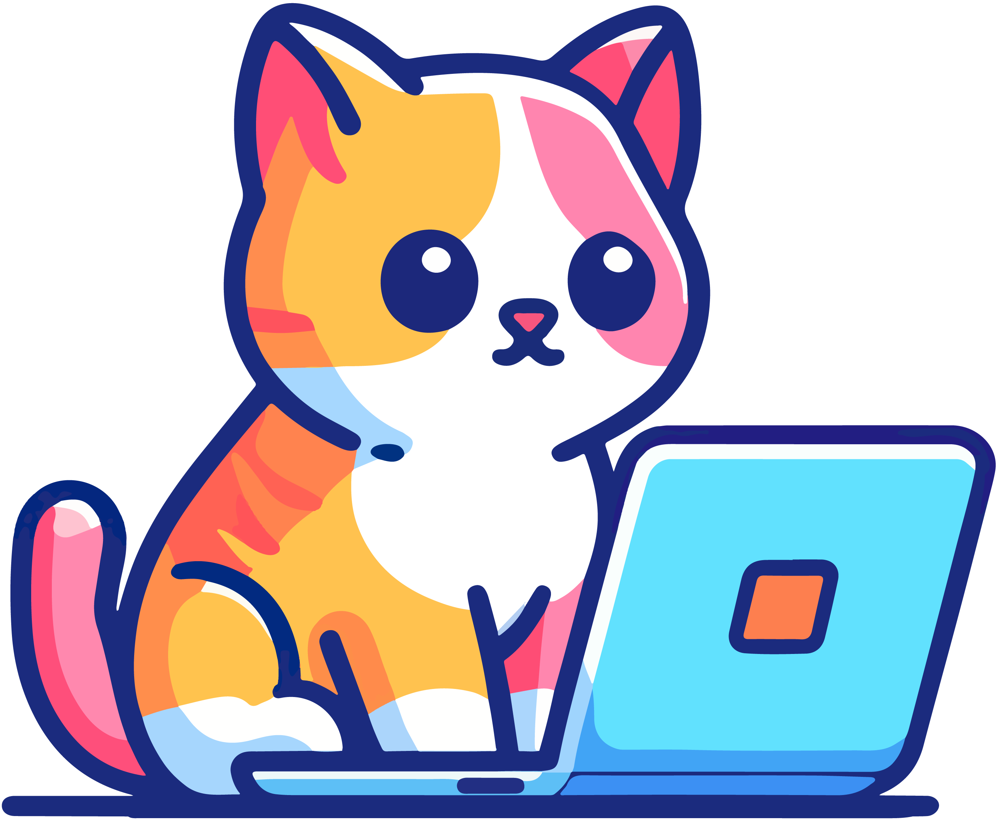

  

###

<h3 align="center">Contacts</h3>

  
  

###

<h3 align="center">Profile Counter</h3>

  

###

<h1 align="center">Hi 👋, I'm Paolo S. Bodnarescul</h1>

###

<h3 align="left">👩‍💻 About Me</h3>

###

I'm Paolo Stefanut Bodnarescul, a tech entusiast from Torino, Italy. 
I recently gratuated with a Master's Degree🎓 in Computer Engineering at Politecnico di Torino.  
I’m currently seeking new and exciting job opportunities 
In my free time I play videogames 🎮, read manga 📚, watch movies 🎬, take care of my cats 🐈 and learn about new technologies 💻

###

<h2 align="left">Skills 🚀</h2>

###

Programming Languages

### 

  
  
  
  
  
  
  
  
  
  
  

###

Front-end Development

###

  
  
  
  
  

###

Back-end Development

###

  
  
  
  
  

###

Testing

###

  
  
  
  
  

###

Database

###

  
  
  

###

DevOps

###

  
  
  

###

Tools

###

  
  
  
  
  
  
  
  
  
  
  

###

  
  

###

<picture>
  <source media="(prefers-color-scheme: dark)" srcset="https://raw.githubusercontent.com/Paolobd/Paolobd/output/snake-dark.svg" />
  <source media="(prefers-color-scheme: light)" srcset="https://raw.githubusercontent.com/Paolobd/Paolobd/output/snake.svg" />
  
</picture>

###

